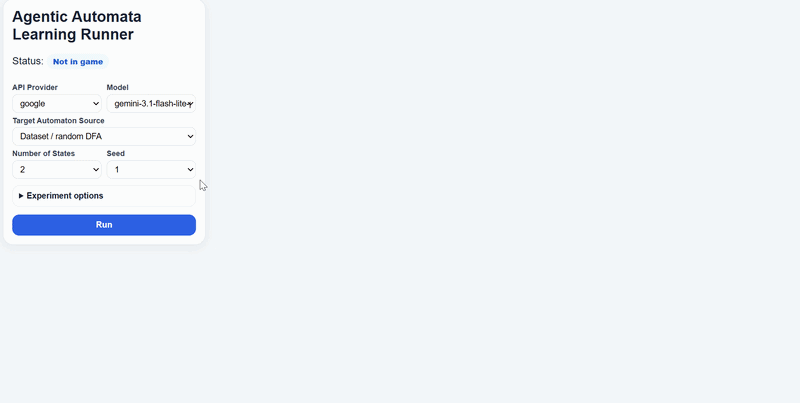

# Agentic Automata Learning

[]()
[](https://agentic-automata-learning.onrender.com)

Agentic Automata Learning is an evaluation framework for studying Large Language Model (LLM) agents. The framework investigates whether agents can infer a hidden structure of an environment through interaction, information gathering, and iterative hypothesis refinement.

## Components

- 📄 **Research Paper** - Introduces the Agentic Automata Learning framework and presents experimental results on modern LLM agents.
- 🌐 **Web Interface** - Agentic Automata Learning Runner, an interactive interface for launching experiments, monitoring agent interactions, and visualizing learning trajectories. Users can explore and run experiments directly in the browser for free, with no installation or API key required.
- 💻 **Source Code** - Complete implementation of the evaluation framework, experiment runner, task generation tools, and analysis utilities.

## Web Interface
<p align="center">
  
</p>

The Agentic Automata Learning Runner provides an interactive web interface for configuring, running, and analyzing Agentic Automata Learning experiments directly from the browser.

The interface first allows users to select the API provider and the model used during the experiment. By default, the runner is configured to use **Gemini 3.1 Flash Lite**, which is available free of charge through a shared daily budget of **$40** across all users of the demo. For other models, users are required to provide their own API key.

Users can choose between two sources for the hidden DFA:

- **User Regular Expression → DFA** – define a custom target automaton by providing a regular expression. The expression is automatically converted into a minimal DFA and used as the hidden target in the experiment.

- **Dataset DFA** – sample a target DFA from the same generated dataset distribution used in our experiments. When this option is selected, users specify:
  - **Number of States** – the number of states in the hidden minimal DFA.
  - **Seed** – the random seed used to select or generate the target automaton.

### Advanced Experiment Options

Some experiment parameters are hidden under the *Experiment Options* section because the default values correspond to the configuration used throughout the paper's evaluation.

- **Alphabet Size** – controls the size of the DFA alphabet used during generation. Larger alphabets generally increase the complexity of the learning task. This parameter is relevant only when using a dataset DFA.

- **Counterexample Mode** – determines how counterexamples are selected when an equivalence query fails. The default setting returns deterministic short counterexamples, matching the protocol used in our experiments.

- **Algorithm Approximation Ratio** – controls the query budget allocated to the agent. The budget is defined relative to the number of queries required by classical active automata learning algorithms, such as L* and TTT. The default value of **2** corresponds to the experimental setup in which agents receive up to twice the query budget required by the stronger classical baseline.


### Running an Experiment

After clicking **Run**, the system first executes the classical active automata learning algorithms **L\*** and **TTT** in order to compute the query budget for the selected target automaton. Once the budget has been determined, the interaction between the LLM agent and the oracle begins. During the game, the interface provides real-time analyses, including whether each query is informative or non-informative, whether passive learning algorithms can already infer the target automaton from the accumulated observations, and the similarity between each proposed hypothesis and the hidden target DFA.

The game ends either when the agent successfully identifies the hidden automaton or when it exhausts its allocated query budget. At the end of the interaction, the game status is updated accordingly. Users can then view a detailed analysis of the run, start a new game, or download the results of all experiments performed so far. The downloaded package includes a consolidated results table, an HTML report for each game containing the complete interaction history and all associated analyses, and PDF reports containing aggregate graphs and visualizations generated from the collected results, corresponding to the analyses presented in the paper.


## Source Code

### Requirements

- Python 3.9 or higher (recommended: Python 3.11)
- pip
- Git

### Setup Instructions

#### 1. Clone the Repository

```bash
git clone https://github.com/USER/Agentic-Automata-Learning.git
cd Agentic-Automata-Learning
```

#### 2. Create a Virtual Environment

```bash
py -3.11 -m venv .venv
.venv\Scripts\activate
```

#### 3. Install Dependencies

```bash
pip install -r requirements.txt
```

### Supported API Providers

The experiment runner supports multiple API providers. The provider is selected using `--api-provider`, while the model is selected using `--model-name`.

Supported providers:

- `google`
- `openai`
- `deepseek`
- `anthropic`
- `together`

### Choosing a Target Automaton

Each experiment requires selecting a hidden target automaton. The framework supports two target sources.

#### 1. Dataset DFA

This option samples a target DFA from the same automatically generated distribution used throughout the experiments in the paper.

Required arguments:

- `--target-source dataset`
- `--n-states` — number of states in the hidden minimal DFA
- `--seed` — random seed used to select or generate the target DFA

Example:

```bash
python main.py ^
  --api-provider google ^
  --model-name gemini-3.1-flash-lite-preview ^
  --api-key YOUR_API_KEY ^
  --target-source dataset ^
  --n-states 4 ^
  --seed 42
```

#### 2. Regular Expression Target

This option allows users to define a custom target automaton by providing a regular expression. The expression is automatically converted into a minimal DFA and used as the hidden target.

Required arguments:

- `--target-source regex`
- `--regex` — regular expression defining the target language

Example:

```bash
python main.py ^
  --api-provider google ^
  --model-name gemini-3.1-flash-lite-preview ^
  --api-key YOUR_API_KEY ^
  --target-source regex ^
  --regex "(a|b)*abb"
```

### Optional Arguments

The following arguments can be added to either target source.

#### Alphabet Size

```bash
--alphabet-size 2
```

Controls the size of the DFA alphabet. This parameter is only relevant when using a Dataset DFA.

#### Counterexample Mode

```bash
--counterexample-mode "deterministic short counterexample"
```

Controls how counterexamples are selected when an equivalence query fails.

Available modes:

- `deterministic short counterexample` — selects a short counterexample deterministically from a small candidate set.
- `minimal counterexample` — always returns the shortest possible counterexample.

#### Algorithm Approximation Ratio

```bash
--algorithm-approximation-ratio 2
```

Controls the query budget allocated to the LLM agent. The budget is computed relative to the number of queries required by the stronger classical baseline between L* and TTT.

#### Output Directory

```bash
--output-dir runs
```

Directory where all experiment outputs are saved.

#### Results CSV

```bash
--experiment-csv results.csv
```

Name of the CSV file used to store experiment results.

### Supported Models

#### Google

```text
gemini-3.1-flash-lite-preview
gemini-3.1-pro-preview
gemini-3-flash-preview
```

#### OpenAI

```text
gpt-5.4
```

#### DeepSeek

```text
deepseek-v4-pro
```

#### Anthropic

```text
claude-sonnet-4-6
```

#### Together

```text
meta-llama/Llama-3.3-70B-Instruct-Turbo
```

### Output

All experiment artifacts are saved inside the selected output directory. By default:

```text
runs/
```

The output directory contains both per-game analyses and aggregate statistics across all experiments.

#### Results Table (`results.csv`)

The central output file is `results.csv`, which contains one row per experiment.

Important columns include:

| Column | Description |
|----------|-------------|
| `llm_model` | Evaluated language model. |
| `number_of_states` | Number of states in the hidden minimal DFA. |
| `alphabet_size` | Alphabet size used during generation. |
| `seed` | Random seed used to generate or select the target automaton. |
| `counterexample_mode` | Counterexample selection strategy. |
| `max_tool_calls` | Query budget allocated to the model. |
| `llm_total_queries` | Number of queries performed by the model. |
| `total_game_time_s` | Total runtime of the experiment. |
| `game_token_tuple` | Token usage statistics. |
| `conversation_link` | Link to the full HTML report. |
| `llm_gold_step` | Step at which the target DFA was identified. |
| `llm_reached_gold_triangle` | Whether the target DFA was successfully recovered. |
| `llm_inefficient_steps` | Number of non-informative queries. |
| `llm_symdiff_similarity_by_step` | Similarity trajectory of the model's hypotheses. |
| `llm_hypothesis_monotonicity_broken` | Whether the hypothesis sequence violated monotonicity. |
| `llm_eq_count_gt_target_states` | Whether the number of equivalence queries exceeded the number of target states. |

#### HTML Reports

The `html/` directory contains a complete report for every game.

Each report includes:

- Full interaction history between the agent and the oracle.
- Membership Queries (MQs) and Equivalence Queries (EQs).
- Visualizations of all proposed DFAs.
- Similarity analyses between hypotheses and the target DFA.
- Non-informative query analyses.
- Passive learning analyses using RPNI, EDSM, and Blue-Fringe.
- Comparisons with L* and TTT.

These reports provide a complete record of the agent's behavior and learning process.

#### Additional Output Directories

- `DFA/` — visualizations of target and hypothesis DFAs.
- `evaluations/` — evaluation artifacts generated during the runs.
- `L_star_comparisons/` — comparisons with the L* algorithm.
- `TTT_comparisons/` — comparisons with the TTT algorithm.

#### Aggregate PDF Report

The generated PDF report summarizes all experiments currently stored in the results table and includes aggregate visualizations similar to those presented in the paper.

The report includes:

- **Success Rate vs. DFA Size** — shows how performance changes as the number of states increases.
- **Average Tool Calls vs. DFA Size** — compares query efficiency against L* and TTT.
- **Best Hypothesis Similarity vs. DFA Size** — measures how close the best hypothesis is to the target DFA.
- **Average Runtime vs. DFA Size** — reports execution time as task complexity increases.
- **Token Usage vs. DFA Size** — summarizes token consumption across experiments.
- **Model Cost vs. DFA Size** — estimates API costs across complexity levels.
- **Passive Learning Analyses** — evaluates whether the information collected by the model would have been sufficient for classical passive learners to recover the target DFA.

Together, the CSV table, HTML reports, and PDF visualizations provide a complete record of the experiments and support both detailed run inspection and large-scale performance analysis.
